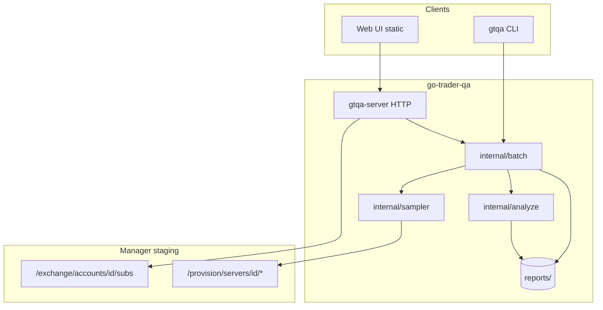
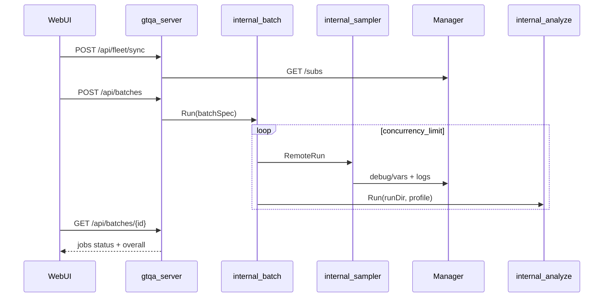

# Phase 2: Analyzer + Batch + Control Plane + Web UI

**Status:** DONE (2026-06-28) — `/design-review` on live Web UI complete (B+ / A- slop)  
**Repo:** go-trader-qa (+ `metrics-catalog.json` in go-trader)  
**Reference:** `../go-trader/.gstack/qa-reports/manager-fleet-api-spec.md`  
**Phase 1:** [docs/phase-1.md](phase-1.md) DONE  
**Fleet design:** `../go-trader/.gstack/qa-reports/fleet_qa_automation_design_0691c1b0.md`

**Phase 1 validation fixtures:**

- `reports/2026-06-28T10-35-12Z-11/` (old log bootstrap)
- `reports/2026-06-28T10-51-41Z-11/` (banner bootstrap; G1/G2 clean — `bus_drops=0`, no 10003)

---

## Goal

Scale fleet QA from **single-server CLI soak** to **analyze + batch + browser control**:

1. Port `soak-analyze.sh` / `soak-report.sh` → `gtqa analyze` producing `qa-report.md` (G1–G7)
2. Run parallel observe-only soaks across multiple `server_id`s with concurrency cap
3. Expose a local **HTTP API** (`gtqa-server`) — JWT stays server-side
4. Ship a **minimal Web UI** that feels fleet-scale: fleet table, batch dashboard, report viewer

**Locked milestone order (CEO):** M1 analyze → M3 batch → M4 API → M5 UI (M2 catalog parallel with M1).



---

## Non-goals (defer)

| Item | Phase |
|------|-------|
| Telegram batch summaries + FAIL alerts | 3 |
| Long-lived service token | 3 |
| Canary presets ("5 random eligible", "all on image X") | 3 |
| Scheduled soaks (nightly 4h) | 3 |
| Manager QA tab embed | 3 |
| Gate/metric checkboxes in UI | 3 |
| S3 artifact storage | 3 |
| Bot start/stop via Manager | 2+ |
| `/subs` pagination (500+ subs) | 2+ |
| gtqa-server auth beyond localhost bind | 2+ (document reverse-proxy) |
| Graceful-shutdown / SIGINT-to-bot soak on production subs | never default |
| Resume partial soaks after server crash | never (re-run is cheap) |

---

## Premises (locked)

1. **Manager-only** — reuse `internal/manager`; QA never calls bot private IPs.
2. **Observe-only default** — no bot start/stop; no `soak-finish.sh` / bot SIGINT in go-trader-qa.
3. **JWT server-side** — `MANAGER_BEARER_TOKEN` only in `gtqa-server` / CLI; Web UI calls local QA API, never Manager directly.
4. **P1 artifact layout preserved** — per-job dirs keep `run.env`, `metrics.tsv`, `soak.log`, `issues.log` plus new `qa-report.md`.
5. **Log bootstrap** — reuse `internal/metrics/logs.go` `FetchLogsFromBotStart` (banner trim).
6. **Default analyzer profile: `wss-only`** — fleet observe QA on live subs; `lifecycle` only with `--profile lifecycle` or UI confirmation ("requires active trading during window").
7. **Analyzer-first** — no UI or batch work before M1 delivers PASS/FAIL.
8. **Anti-duplication** — `internal/batch` and `internal/api` use injected `*manager.Client` only; gate logic lives in `internal/analyze` (M1 hardcoded); M2 catalog drives profile gate lists without duplicating rules in JSON and Go.

---

## Deliverables

| # | Deliverable | Acceptance |
|---|-------------|------------|
| D1 | `internal/analyze` — G1–G7 gate logic | Unit tests match `soak-analyze.sh` on fixture TSV |
| D2 | `gtqa analyze <run-dir> [--profile wss-only\|lifecycle]` | Writes `qa-report.md`; exit 0/1 on PASS/FAIL |
| D3 | `metrics-catalog.json` + `internal/catalog` | Gates G1–G7, profiles, column mapping (M2, parallel with M1) |
| D4 | `gtqa soak batch --server-ids 11,22 --duration 30m --concurrency 2` | `reports/batch-{ts}/jobs/{ts}-{id}/` per server |
| D5 | Auto-analyze after each batch job | Each job dir contains `qa-report.md` |
| D5b | `batch-summary.md` at batch root (CEO CP1) | Human-readable rollup: jobs table + PASS/FAIL counts |
| D6 | `cmd/gtqa-server` HTTP API | Endpoint table below; curl-able |
| D7 | Minimal Web UI wired to API | Fleet + dashboard + report viewer |
| D7b | Fleet shortcuts (CEO CP2) | Eligible filter, select-all-eligible, eligible count badge |
| D7c | Recent batches panel (CEO CP3) | Last 20 batches from `reports/batch-*` on home |
| D8 | wss-only default documented | `gtqa analyze reports/2026-06-28T10-51-41Z-11` → PASS |

---

## Package layout

```
go-trader-qa/
├── cmd/
│   ├── gtqa/              # existing CLI (+ analyze, soak batch)
│   └── gtqa-server/       # HTTP control plane + static web/
├── internal/
│   ├── analyze/           # gates, report builder
│   ├── batch/             # SoakBatch, worker pool, job state
│   ├── api/             # HTTP handlers, fleet cache, JSON types
│   ├── catalog/         # load metrics-catalog.json
│   ├── config/          # + GTQA_LISTEN_ADDR, GTQA_MAX_CONCURRENCY*
│   ├── fleet/, manager/, metrics/, sampler/  # P1 core (extend sampler)
├── web/
│   ├── index.html         # fleet + launcher + recent batches
│   └── static/            # CSS/JS (gstack-design-html)
├── reports/
└── docs/phase-2.md

go-trader/
└── .gstack/qa-reports/
    └── metrics-catalog.json
```

**CLI commands (Phase 2):**

```
gtqa analyze <run-dir> [--profile wss-only|lifecycle]
gtqa soak batch --server-ids 11,22 --duration 30m [--interval 5m] [--concurrency 2] [--profile wss-only] [--analyze]
gtqa-server                    # HTTP API + web/ on GTQA_LISTEN_ADDR
```

---

## Reuse map (do not reimplement)

```text
gtqa fleet sync ──► manager.FleetSubs + fleet.BuildRows
gtqa smoke      ──► manager provision methods
gtqa soak run   ──► sampler.RemoteRun(ctx, client, opts)
                         ├── manager.ServerDebugVars / ServerLogs
                         ├── metrics.RowFromVars / CountLogPatterns
                         └── metrics.FetchLogsFromBotStart

Phase 2 adds only:
  internal/analyze  ─ reads metrics.tsv + soak.log + run.env
  internal/batch    ─ worker pool → sampler + analyze
  internal/api      ─ thin HTTP over batch + fleet cache + disk artifacts
  cmd/gtqa-server   ─ serves api + web/
```

---

## Data model

### SoakBatch

```go
type SoakBatch struct {
    ID             string    // "batch-20260628T120000Z"
    ServerIDs      []int
    Duration       time.Duration
    Interval       time.Duration
    Concurrency    int       // default 2, max GTQA_MAX_CONCURRENCY_HARD (3)
    Profile        string    // default "wss-only"
    SkipIneligible bool      // default true
    Status         string    // pending|running|complete|failed|cancelled
    Dir            string    // reports/batch-{id}/
    StartedAt      time.Time
    CompletedAt    *time.Time
}
```

### SoakJob

```go
type SoakJob struct {
    BatchID      string
    ServerID     int
    PairID       string
    RunDir       string    // {Batch.Dir}/jobs/{ts}-{server_id}
    Status       string    // queued|running|complete|failed|skipped
    SkipReason   string
    Overall      string    // PASS|FAIL|UNKNOWN
    Samples      int
    LastBusDrops int64     // dashboard field
}
```

**State machines:** Batch `pending` → `running` → `complete|failed|cancelled`. Job `queued` → `running` → `complete|failed|skipped`.

### Artifact layout

```text
reports/                                    # QA_ARTIFACTS_DIR
├── {timestamp}-{server_id}/                # CLI: gtqa soak run (UNCHANGED P1)
│   ├── run.env, metrics.tsv, soak.log, issues.log
│   └── qa-report.md
└── batch-{batch_ts}/                       # CLI/API batch
    ├── batch.env
    ├── batch-summary.json
    ├── batch-summary.md                    # CEO CP1
    └── jobs/
        └── {job_ts}-{server_id}/
            ├── run.env, metrics.tsv, soak.log, issues.log
            ├── config_snapshot.json        # from Manager /config at job start
            └── qa-report.md
```

**Rules:**

- Never write batch jobs to `reports/` root — only under `batch-{id}/jobs/`
- `gtqa analyze` accepts any run dir (flat or nested)
- API artifact whitelist: `metrics.tsv`, `soak.log`, `issues.log`, `run.env`, `qa-report.md`, `config_snapshot.json` — reject path traversal

---

## Analyzer (M1) — port soak-analyze.sh

### Gates

| Gate | Rule | Profile |
|------|------|---------|
| G1 | `bus_drops` delta first→last == 0 | both |
| G2 | no `retCode=10003` in soak.log | both |
| G3 | `order_filter_cancel` delta > 0 OR resting_proxy ≤ 30 | lifecycle |
| G4 | no position activity (both deltas 0) OR paired open+reset (both ≥ 1); fail if inconsistent | lifecycle |
| G5 | `order_create_ok` delta ≥ 85% of `position_reset` delta | lifecycle |
| G6 | `position_reset` delta ≤ `position_opened` delta + 1 | lifecycle |
| G7 | pause/resume pairing (in-flight cooldown math) | lifecycle |

### Inputs / outputs

| File | Required | Use |
|------|----------|-----|
| `run.env` | yes | server_id, duration, started, profile, pair_id, batch_id |
| `metrics.tsv` | yes | G1, G3–G7 deltas (first data row → last row) |
| `soak.log` | yes for G2 | grep `retCode=10003` |
| `issues.log` | no | report appendix |
| `config_snapshot.json` | no | algorithm metadata in qa-report |

| Output | Content |
|--------|---------|
| `qa-report.md` | Port `soak-report.sh` structure: metadata, gate table, OVERALL PASS/FAIL |
| exit code | 0 = PASS, 1 = FAIL |

### Implementation

- Add `metrics.ReadTSV(path) ([]Row, error)` and `MetricDelta(rows, col)` in `internal/metrics/row.go` — single TSV parser for sampler and analyze.
- G2 reuses `CountLogPatterns` / same regex as bash.
- Gate math: literal port of `soak-analyze.sh` lines 125–201 in M1; M2 refactors to catalog-driven profile gate lists.
- **Validation:** `gtqa analyze reports/2026-06-28T10-51-41Z-11 --profile wss-only` → PASS.

---

## Metrics catalog (M2) — go-trader

Add `../go-trader/.gstack/qa-reports/metrics-catalog.json`:

- `metrics[]` — expvar key → TSV column
- `log_patterns[]` — grep patterns
- `gates[]` — id, rule, threshold
- `profiles` — `wss-only: [G1,G2]`, `lifecycle: [G1..G7]`

`internal/catalog` loads via `GTQA_CATALOG_PATH` or default sibling path in dev.

**Ordering:** M1 ships hardcoded gates first; M2 wires catalog without duplicating rule logic in JSON.

---

## Sampler extensions (batch-aware)

Extend `sampler.Options` (P1 unchanged when no batch context):

- Optional `RunDirName` (empty = current `{timestamp}-{server_id}` behavior)
- Batch sets `ArtifactsDir = batch-{id}/jobs/`
- After preflight: write `pair_id`, `profile`, `batch_id` into `run.env`
- Fetch `manager.ServerConfig` → `config_snapshot.json` at job start

Single-server `gtqa soak run` unchanged when `ArtifactsDir=reports/` and no batch context.

---

## Batch orchestration (M3)

### CLI

```
gtqa soak batch \
  --server-ids 11,22 \
  --duration 30m \
  --interval 5m \
  --concurrency 2 \
  --profile wss-only \
  --skip-ineligible \
  [--analyze]            # default true
```

### Worker pool

- Semaphore `concurrency` (default **2**, hard cap **3** via `GTQA_MAX_CONCURRENCY_HARD`)
- **30s stagger** between job starts (avoid Manager thundering herd)
- Each worker: `sampler.RemoteRun` → `analyze.Run(runDir, profile)`
- Update `batch-summary.json` atomically; write `batch-summary.md` on batch complete
- SIGINT: cancel in-flight jobs; `monitor_shutdown` per P1 rules
- Skip ineligible servers when `--skip-ineligible` (default true); record `SkipReason` in summary

### Batch state

- In-memory registry for running batches (goroutines, cancel funcs)
- Persist `batch-summary.json` + `batch.env` on disk
- On `gtqa-server` restart: mark in-flight jobs `failed` with `server_restarted` — do not resume

### CLI / server parity

`gtqa soak batch` and `POST /api/batches` both call `internal/batch.Run` — no duplicate orchestration logic.

---

## HTTP API (M4) — gtqa-server

### Config

```bash
GTQA_LISTEN_ADDR=127.0.0.1:8080    # default localhost
GTQA_MAX_CONCURRENCY=2
GTQA_MAX_CONCURRENCY_HARD=3
# inherits MANAGER_* and QA_ARTIFACTS_DIR from P1
```

**Auth v1:** none on QA API; JWT only in server process for Manager calls.

### Endpoints

| Method | Path | Request body | Response | Notes |
|--------|------|--------------|----------|-------|
| GET | `/api/health` | — | `{"ok":true,"version":"..."}` | Liveness |
| GET | `/api/fleet` | — | `{"synced_at":"...","rows":[FleetRow...]}` | Cached; 503 if never synced |
| POST | `/api/fleet/sync` | — | same as GET | Calls Manager `/subs` |
| POST | `/api/batches` | `{"server_ids":[11,22],"duration":"30m","interval":"5m","profile":"wss-only","concurrency":2,"skip_ineligible":true}` | `201 {"batch_id":"...","status":"running"}` | Validates concurrency ≤ hard cap |
| GET | `/api/batches` | `?limit=20` | `{"batches":[...]}` | Recent batches (CP3) |
| GET | `/api/batches/{batch_id}` | — | `SoakBatch` + `jobs[]` live fields | Dashboard poll target |
| POST | `/api/batches/{batch_id}/cancel` | — | `{"status":"cancelling"}` | Cancel ctx; monitor_shutdown per job |
| GET | `/api/batches/{batch_id}/summary` | — | `batch-summary.json` raw | Download |
| GET | `/api/batches/{batch_id}/jobs/{server_id}` | — | `SoakJob` detail | |
| GET | `/api/batches/{batch_id}/jobs/{server_id}/report` | — | `text/markdown` | 404 if analyze not run |
| GET | `/api/batches/{batch_id}/jobs/{server_id}/artifacts/{name}` | — | file stream | Whitelist only |
| POST | `/api/analyze` | `{"run_dir":"...","profile":"wss-only"}` | `{"overall":"PASS","report_path":"..."}` | Re-analyze without re-soak |
| GET | `/*` | — | static `web/` | After `/api/*` routes |



---

## Web UI (M5) — minimal fleet-scale

Build after API routes stable; use **gstack-design-shotgun** → **design-html** for mockups.

### Three views (one static app — no React, no build step)

1. **Fleet** — Sync button, eligible count badge, client-side search/filter, **filter eligible only**, **select all eligible**, multi-select, "Run soak (N)", profile picker (`wss-only` default, lifecycle behind confirm)
2. **Batch dashboard** — progress, per-job status/samples/`bus_drops`/PASS/FAIL, link to report; poll `GET /api/batches/{id}` every 10s
3. **Report viewer** — rendered `qa-report.md`, artifact download links

### Home extras (CEO cherry-picks)

- **Recent batches** panel — last 20 from `GET /api/batches?limit=20`
- **Fleet shortcuts** — eligible filter, select-all-eligible, count badge

### Explicitly NOT in M5

Server-side pagination, gate checkboxes, sparklines, canary presets, tag editing, Telegram.

**Tech:** static HTML + vanilla JS (or HTMX), served by `gtqa-server`.

---

## Implementation milestones

### M0 — Plan approval (done)

- [x] Write `docs/phase-2.md`
- [x] `/plan-eng-review`, `/plan-ceo-review` folded
- [ ] `/plan-design-review` optional before M5 UI
- [x] Status → APPROVED before M1 code

### M1 — Analyzer (1–1½ days) — critical path

- [x] `metrics.ReadTSV` + `MetricDelta` in `internal/metrics/row.go`
- [x] `internal/analyze/gates.go` — G1–G7 literal port
- [x] `internal/analyze/report.go` — qa-report.md
- [x] `gtqa analyze <run-dir> [--profile]`
- [x] Golden tests on `10-51-41Z-11` fixture (wss-only PASS)

### M2 — Metrics catalog (½ day, parallel with M1)

- [x] `metrics-catalog.json` in go-trader
- [x] `internal/catalog` loader + tests
- [x] Note in go-trader `.gstack/qa-reports/README.md`

### M3 — Batch soak (1 day)

- [x] Extend `sampler.Options` for batch metadata
- [x] `internal/batch/runner.go` — semaphore, stagger, skip ineligible
- [x] `gtqa soak batch` command
- [x] Post-job analyze + `batch-summary.md` / `batch-summary.json`

### M4 — HTTP server (1 day)

- [x] `cmd/gtqa-server/main.go`
- [x] `internal/api/handlers.go` — fleet cache, batch registry, artifact whitelist
- [x] httptest: POST batch → GET status

### M5 — Web UI (1–1½ days)

- [x] `web/` — Light Split design (design-shotgun variant C)
- [x] Fleet shortcuts + recent batches (CP2, CP3)
- [x] README: `gtqa-server` workflow

### M6 — Polish (½ day)

- [x] Update README.md, CLAUDE.md
- [x] Cross-ref phase-1 non-goals as done

---

## Test plan

| Test | Type |
|------|------|
| G1–G7 gate logic | table-driven unit (fixture TSV from `10-51-41Z-11`) |
| G7 in-flight cooldown edge cases | unit |
| `metrics.ReadTSV` + delta first→last | unit |
| G2 log grep on fixture soak.log | unit |
| `gtqa analyze` on `10-51-41Z-11` | manual — wss-only PASS |
| lifecycle on observe-only fixture (no fills) | G4 PASS when position deltas 0/0; overall PASS if G1–G7 pass |
| Catalog load + profile gate list | unit |
| Batch concurrency cap + 30s stagger | unit (mock sampler) |
| Skip ineligible server | unit |
| Cancel mid-batch | manual |
| API POST batch → GET status | httptest |
| Artifact path whitelist / traversal block | httptest |
| Web UI smoke | manual — sync, run, view report, reopen recent batch |

**Critical M1 tests:** table-driven G1–G7 against committed TSV/log fixtures from `10-51-41Z-11`.

---

## Risks

| Risk | Mitigation |
|------|------------|
| lifecycle FAIL on observe-only subs | Default **wss-only**; UI labels lifecycle "requires active trading" |
| JWT expires mid-batch | Fail job with clear error; document refresh |
| Only 1 eligible server on staging | Batch test with `--server-ids 11` or mock |
| Docker log buffer > 50k lines | Bootstrap warns (P1); document max tail |
| Local gtqa-server no auth | Bind `127.0.0.1` by default |
| Cumulative counters span pre-soak boot | Report notes sample window; lifecycle needs trading during window |
| gtqa-server crash mid-batch | Mark jobs failed; re-run batch |

---

## Failure modes

| Path | Handling | User sees |
|------|----------|-----------|
| Missing Referer → Manager 403 | P1 httptest | job failed, clear error |
| JWT expired mid-batch | partial failure | job failed in summary |
| lifecycle on stopped bot | warn only; G3–G7 FAIL | FAIL report — use wss-only |
| analyze before soak done | 409 on API | "job still running" |
| Log tail dupes | P1 dedupe test | mitigated by full-buffer grep |

---

## Success criteria (Phase 2 done)

- [x] `gtqa analyze reports/2026-06-28T10-51-41Z-11` → wss-only PASS, `qa-report.md` exists
- [x] `gtqa soak batch --server-ids 11 --duration 15s --concurrency 1` → job dir + auto analyze + `batch-summary.md`
- [x] `gtqa-server` serves fleet JSON, accepts batch POST, recent batches list works
- [x] Web UI: sync, filter eligible, select-all, run soak, view report, reopen recent batch
- [x] `metrics-catalog.json` committed in go-trader
- [x] No Manager backend changes required

---

## Parallelization (implementation)

| Lane | Steps | Depends on |
|------|-------|------------|
| A | M1 analyzer + golden tests | M0 approved |
| B | M2 catalog | — (parallel with A) |
| C | design-shotgun/html for M5 | — (parallel with A) |
| D | M3 batch → M4 API → M5 UI | M1 complete |

**Conflict:** M4 and M5 both touch `gtqa-server` — sequential within lane D.

---

## After Phase 2

Phase 3 adds Telegram notifications, scheduled soaks, canary presets, gate UI checkboxes, and scale ops (pagination, S3).

---

## GSTACK REVIEW REPORT (CEO)

**Reviewer:** /plan-ceo-review  
**Date:** 2026-06-28  
**Mode:** SELECTIVE EXPANSION  
**Verdict:** APPROVED WITH CHANGES

### Step 0 — Premise challenge

**Right problem?** Yes — Phase 1 collects metrics; fleet ops needs PASS/FAIL at scale.  
**Outcome:** Run N soaks, get N verdicts + one batch rollup, without SSH or bot IPs.

### Implementation approach

| Approach | Verdict |
|----------|---------|
| A: Analyzer-first CLI → API → UI (M1→M3→M4→M5) | **Selected** |
| B: UI-first | Rejected — no verdict |
| C: Batch CLI only, defer UI | Rejected — user confirmed full M0–M5 |

### Cherry-picks accepted

| Proposal | Decision |
|----------|----------|
| `batch-summary.md` | **ACCEPTED** (D5b) |
| Eligible filter + select-all + badge | **ACCEPTED** (D7b) |
| Recent batches panel | **ACCEPTED** (D7c) |
| Gate checkboxes in UI | **DEFERRED** → Phase 3 |
| Telegram, S3, scheduling | **DEFERRED** → Phase 3 |

### Key CEO decisions

1. **Analyzer-first** — non-negotiable order  
2. **Minimal fleet-scale UI** — 3 views, profile picker not gate picker  
3. **Phase 3 boundary** — notify + schedule + scale ops  
4. **wss-only default** — production-safe observe QA

---

## GSTACK REVIEW REPORT (Eng)

**Reviewer:** /plan-eng-review  
**Date:** 2026-06-28  
**Verdict:** APPROVED WITH CHANGES (10 findings folded)

### Step 0 — Scope challenge

Scope accepted **full M0–M5**. ~12 new files across 4 packages — acceptable with milestone sequencing.

### Architecture Review

| # | Sev | Finding | Resolution |
|---|-----|---------|------------|
| 1 | P1 | Sampler not batch-aware | Extend `sampler.Options`; batch enriches metadata + `config_snapshot.json` |
| 2 | P1 | Ambiguous job URL `{id}` | Nest under `/api/batches/{batch_id}/jobs/{server_id}/...` |
| 3 | P2 | No batch restart semantics | Disk summary; mark in-flight failed on server restart |
| 4 | P2 | Fleet GET hammers Manager | Cache + `POST /api/fleet/sync` |
| 5 | P2 | Concurrency unspecified | Default 2, hard cap 3, 30s stagger |
| 6 | P2 | Catalog/analyze ordering | M1 literal port; M2 catalog-driven refactor |
| 7 | P3 | Duplicate orchestration risk | CLI and server share `internal/batch` only |

### Code Quality Review

| # | Sev | Finding | Resolution |
|---|-----|---------|------------|
| 8 | P2 | TSV parsing duplication risk | Add `metrics.ReadTSV` shared package |
| 9 | P3 | G2 regex reuse | Call `CountLogPatterns` or shared constants |

### Test Review

14 test gaps identified at review time. Priority: golden wss-only PASS on `10-51-41Z-11`, G7 edge cases, httptest batch API, artifact whitelist.

### Performance Review

| # | Sev | Finding | Resolution |
|---|-----|---------|------------|
| 10 | P2 | Parallel soaks without stagger | 30s stagger between job starts |

### What already exists

Phase 1 packages; bash reference (`soak-analyze.sh`, `soak-report.sh`); Manager API spec; two 30m soak fixtures.

### NOT in scope

Telegram, bot start/stop, S3, pagination, destructive shutdown profile, server-side soak resume.

### Completion summary

- Architecture: 7 issues → all folded  
- Code quality: 2 issues → folded  
- Test review: 14 gaps documented  
- Performance: 1 issue → folded  
- Unresolved: none blocking M1 implementation

---

## GSTACK REVIEW REPORT (Design)

*(Pending `/plan-design-review` before M5 UI implementation)*
